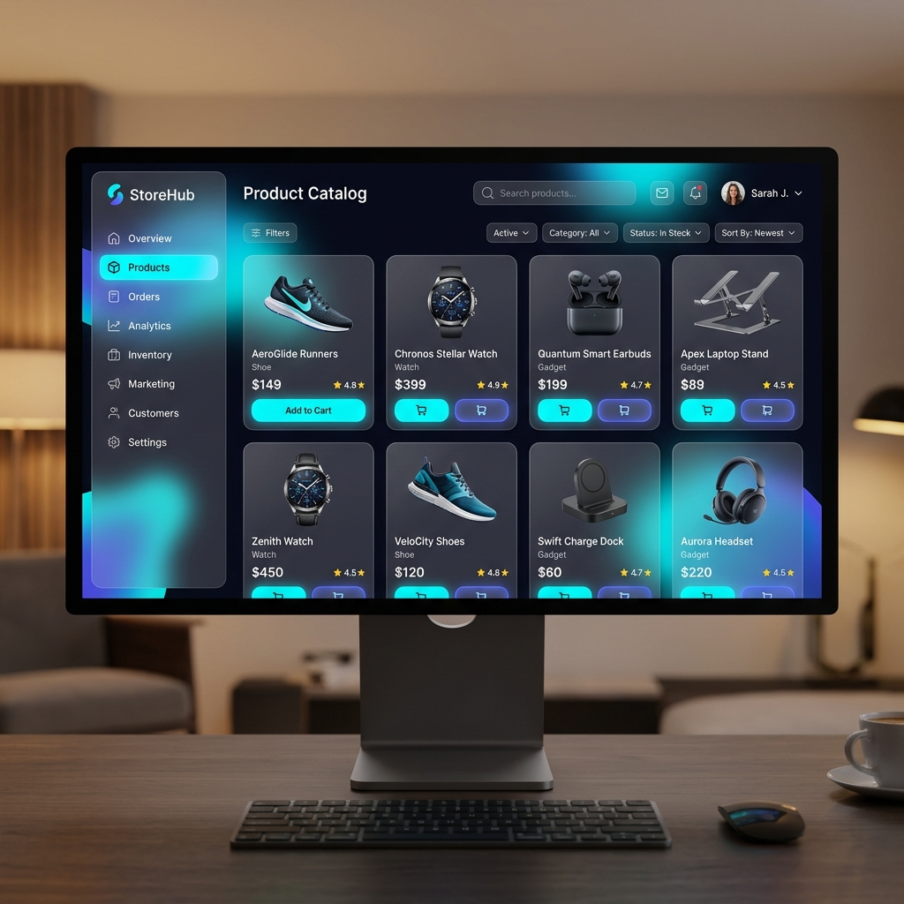

<div align="center">
  
  <h1>🏪 StoreHub</h1>
  <p><strong>A Modern & Secure E-Commerce Full-Stack Solution</strong></p>

  [](https://dotnet.microsoft.com/)
  [](https://www.postgresql.org/)
  [](https://www.docker.com/)
  [](https://opensource.org/licenses/MIT)

  ---
</div>

## 🚀 About the Project
**StoreHub** is a comprehensive e-commerce platform designed with scalability, security, and a premium user experience in mind. It consists of a robust **ASP.NET Core 10** backend and a sleek, modern **Vanilla JS** frontend. This project demonstrates modern software architecture patterns like DTOs, Repository-like behavior (EF Core), Global Exception Handling, and more.

### ✨ Preview
<div align="center">
  
</div>

---

## 🛠️ Tech Stack & Key Features

### Backend (`StoreHub.API`)
*   **Framework:** .NET 10 (ASP.NET Core Web API)
*   **Database:** PostgreSQL with **Entity Framework Core** (Code-First)
*   **Security:** Role-based Authorization with **JWT** (JSON Web Tokens) and secure password hashing via `BCrypt`.
*   **Documentation:** Interactive API docs using **Scalar** (OpenAPI 3.1).
*   **Data Integrity:** 
    *   Strict input validation through **FluentValidation** pipelines.
    *   Clean decoupling using **DTO (Data Transfer Object)** pattern with **AutoMapper**.
    *   ACID-compliant transactions for order processing.
*   **Performance:** Memory caching strategies (`IMemoryCache`) for lightning-fast catalog browsing.
*   **Architecture:** Centralized **Global Exception Middleware** for consistent error reporting.

### Frontend (`StoreHub.Frontend`)
*   **Engine:** Modern HTML5 / CSS3 / Vanilla JavaScript.
*   **UI/UX:** Premium **Glassmorphism** design, responsive layouts, and smooth micro-animations.
*   **Integration:** Real-time communication with the backend API via `fetch` API.
*   **Persistence:** Local storage synchronization for shopping basket and session management.

---

## 📂 Project Structure
```text
StoreHub/
├── StoreHub.API/          # ASP.NET Core 10 Backend
│   ├── Controllers/       # API View-Models/Controllers
│   ├── Data/              # DbContext & Database configuration
│   ├── DTOs/              # Data Transfer Objects for Client-Server decoupling
│   ├── Middlewares/       # Exception Handling & Custom logic
│   └── Properties/        # Launch settings
├── StoreHub.Frontend/     # Modern Vanilla JS Frontend
│   ├── index.html         # Main Entry point
│   ├── style.css          # Premium Custom Styling
│   └── app.js             # Frontend Logic & API Integration
├── assets/                # README images & Resources
└── docker-compose.yml     # Container Orchestration
```

---

## ⚙️ Getting Started

### Prerequisites
- [.NET 10 SDK](https://dotnet.microsoft.com/download)
- [PostgreSQL](https://www.postgresql.org/)
- [Docker](https://www.docker.com/products/docker-desktop) (Optional - for containerized setup)

### Local Development Setup

1. **Clone the repository:**
   ```bash
   git clone https://github.com/Sectarmus/StoreHub.git
   cd StoreHub
   ```

2. **Backend Configuration:**
   - Update the connection string in `StoreHub.API/appsettings.json`:
     ```json
     "ConnectionStrings": {
       "DefaultConnection": "Host=localhost;Database=StoreHubDb;Username=postgres;Password=your_password"
     }
     ```
   - Apply database migrations:
     ```bash
     cd StoreHub.API
     dotnet ef database update
     ```

3. **Run the API:**
   ```bash
   dotnet run
   ```
   *Access API Docs at: `http://localhost:5000/scalar/v1`*

4. **Frontend Configuration:**
   - Open `StoreHub.Frontend/index.html` in your browser. (The script automatically connects to the backend on `localhost:5000`).

---

## 🐳 Docker Deployment
You can run the entire stack (API, DB, and Web Server) using Docker:
```bash
docker-compose up --build
```

---

## 🛡️ Security Features
- **JWT Authn/Authz**: Secure token-based access control.
- **CORS Policies**: Restricted origins for production-grade security.
- **Hashing**: `BCrypt` hashing for all sensitive user credentials.
- **Sanitization**: Automated input cleanup via FluentValidation.

---

## 📄 License
This project is licensed under the [MIT License](LICENSE).

## 👨‍💻 Developed By
**Alper (Sectarmus)**

---
<p align="center">Made with ❤️ for modern e-commerce scalability.</p>
